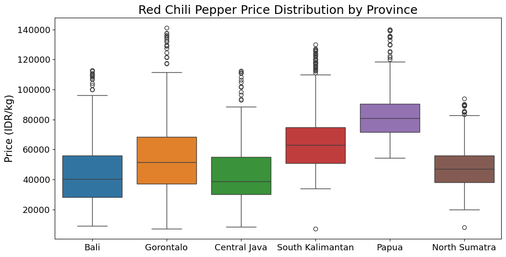

<h1 align="center">Indonesia's Red Chili Pepper Retail Price Forecasting with MIMO LSTM Model Optimized with TPE</h1>

  
  
  
  
  
  
  
  
  

---

## 📌 Project Overview
Red chili pepper (*Cabai Rawit Merah*) is one of the most essential spices in Indonesian cuisine. Known for its fiery taste, it is widely used in various traditional dishes and is almost inseparable from Indonesian dining culture. Its presence is especially significant during special celebrations, communal gatherings, and in countless street food vendors, making it a staple ingredient that strongly represents Indonesian food identity.

With such high demand, red chili pepper has become more than just a cooking ingredient, it is now considered a strategic commodity in Indonesia. Price fluctuations of this commodity can directly impact household spending and food vendors. Therefore, analyzing its retail price over time is crucial to better understand supply-demand dynamics and potential market volatility.

This analysis covers multiple regions across Indonesia, with provinces selected to represent major islands of the archipelago. Specifically, Bali represents the island of Bali, Gorontalo for Sulawesi, Central Java for Java, South Kalimantan for Kalimantan, Papua for Papua, and North Sumatra for Sumatra. By including provinces from different islands, this study aims to capture a comprehensive and strategic overview of chili price behavior across the nation.

The ultimate expectation of this analysis is to provide valuable insights for multiple stakeholders. For farmers, it may serve as a reference to plan cultivation and harvest cycles. For consumers, it can help anticipate price fluctuations and manage household expenses. For the government, these findings can support policy-making and future strategies to stabilize food prices and ensure sustainable food security in Indonesia.

The Indonesian Retail Commodity Price Dataset used in this analysis was obtained from the [National Food Agency Price Panel](https://panelharga.badanpangan.go.id). The dataset covers the provinces of **Bali**, **Gorontalo**, **Central Java**, **South Kalimantan**, **Papua**, and **North Sumatra**. The data includes various commodities, but for this analysis, the focus will be on the commodity **Red Chili Pepper**, a natural ingredient commonly used in Indonesian cuisine.

This dataset is structured as a **time series** in **daily units**, spanning from **March 2021 to December 2023**. The dataset contains commodity price data recorded in **Indonesian Rupiah (IDR)** and expressed per **kilogram** (IDR/kg).

---

## ⚙️ Methodology

### 1. Exploratory Data Analysis (EDA)
- Identifying and analyzing missing values to understand data completeness and decide on proper handling strategies.
- Detecting duplicate records that may introduce bias and ensuring data integrity.
- Examining data distribution patterns and identifying potential outliers that may distort statistical analysis or modeling. *(Using boxplots)*
- Measuring skewness and kurtosis to evaluate whether the data approximates a normal distribution or shows deviations. *(Using histograms, skewness, and kurtosis calculations for each variable)*
- Visualizing time series data with line charts to observe trends, seasonality, and fluctuations over time.
- Assessing correlations among variables at the current time to uncover potential relationships relevant for MIMO modeling. *(Using Pearson correlation)*
- Analyzing autocorrelations across different lags to understand dependencies in time series data, which is critical for determining forecasting model window size/look-back period. *(Using ACF plots)*

### 2. Data Cleaning and Pre-processing
- Handling missing values and duplicate records.
- Splitting the dataset into **90% training**, **5% validation**, and **5% testing**.
- Applying **Min-Max normalization** to standardize the data range across all provinces and avoid bias during the training of the MIMO LSTM model.

### 3. Modeling & Evaluation
- Build a **Multi-Input Multi-Output (MIMO) LSTM** architecture tailored for multivariate time series forecasting.
- Optimize hyperparameters using **Tree-Structured Parzen Estimator (TPE)** to improve forecasting performance.
- Train the model on the processed dataset, using validation data to prevent overfitting.
- Evaluate the model using the **test set** with metrics such as **MAE (Mean Absolute Error)**, **MSE (Mean Squared Error)**, and **MAPE (Mean Absolute Percentage Error)**.
- Compare forecasting results across provinces to analyze regional differences in chili price dynamics.

---

## 📊 Analysis Result

### 1. Data Distribution & Outliers Analysis

  

> *Prices in **Papua** tend to be higher and more volatile, while in **North Sumatra** they are relatively stable. **Bali** and **Central Java** usually show lower prices, though all provinces occasionally experience sudden spikes.*

### 2. Skewness and Kurtosis Analysis

  

> *In most provinces, chili prices are generally concentrated at lower levels but sometimes experience sharp jumps. **Papua** is the most prone to extreme price hikes, while **North Sumatra** shows the most balanced price distribution pattern.*

### 3. Line Chart Visualization (Raw Dataset)

  

> *Chili prices move in repeating seasonal cycles across all regions, with Papua consistently being the most expensive, Bali and Central Java showing very similar trends, then data gaps appearing in all provinces at the beginning and around July 2022 due to incomplete records from the data source.*

 ### 4. `Current Time` Data Correlation

  

> *Chili prices in Indonesia display strong regional clustering with provinces in Java and Kalimantan move closely together, while Papua and North Sumatra show more independent trends. This suggests that while some markets are highly interconnected, others operate under distinct local factors.*

 ### 5. Autocorrelation Function (ACF) Plot

  

> Chili prices are strongly connected to their recent past, with today’s price still influenced by prices from the last few weeks, especially within about one month (25 - 40 days).

 ### 6. Line Chart Forecast Result (from October 18th 2023 to December 31th 2023)

  

- Bali -> MAE: 2342.19 - MSE: 8978403.24 - MAPE: 3.17%
- Gorontalo -> MAE: 7753.80 - MSE: 280432855.08 - MAPE: 7.80%
- Central Java -> MAE: 2780.20 - MSE: 12557093.02 - MAPE: 3.61%
- South Kalimantan -> MAE: 4677.28 - MSE: 44698101.20 - MAPE: 5.92%
- Papua -> MAE: 6045.75 - MSE: 95569425.45 - MAPE: 6.09%
- North Sumatra -> MAE: 6900.77 - MSE: 71207715.69 - MAPE: 9.87%

> *Overall, the model successfully generalizes the cyclical patterns across provinces, particularly in regions with stable trends (Bali, Central Java). However, for provinces with more irregular or volatile price dynamics (Gorontalo, North Sumatra), the model requires further refinement, possibly through hybrid approaches, feature enrichment, or better handling of sudden shocks.*

---

## 💡 Conclution

This project uses a single **MIMO LSTM** model to forecast daily retail prices of red chili pepper across six representative Indonesian provinces. The model captures repeating seasonal cycles and shared patterns across regions, but forecast accuracy varies by province due to differences in volatility and data quality.

- **Highlight 1 (Seasonality):** Prices in all provinces show clear seasonal cycles and repeating ups-and-downs.  
- **Highlight 2 (Regional clustering):** Bali, Central Java, and South Kalimantan tend to move together (high correlation), while Papua and North Sumatra behave more independently.  
- **Highlight 3 (MIMO LSTM model performance):** The model performs best in **Bali** and **Central Java** (MAPE ≈ 3%), moderately in **South Kalimantan** and **Papua** (MAPE ≈ 6%), and worse in **Gorontalo** and **North Sumatra** (MAPE ≈ 8–10%).  
- **Highlight 4 (Outliers & spikes):** All provinces show occasional extreme price spikes (outliers) that are part of real market dynamics.  
- **Highlight 5 (Data quality):** There are missing-value gaps (notably around July 2022) and some suspicious sudden drops early in the series that need cleaning or verification.

---

## 🎯 Recomendation

**From Highlight 1 (Seasonality):**  
  - Farmers can schedule planting and harvesting to align with expected high-price periods.  
  - Traders and consumers can use simple seasonal awareness (buy/store before expected peaks).

**From Highlight 2 (Regional clustering):**  
  - Regional price monitoring and logistics coordination between correlated provinces (e.g., Java ↔ Kalimantan) can help dampen local shocks.

**From Highlight 3 (Model performance):**  
  - Use the MIMO LSTM forecast as a reliable guide in provinces with low MAPE (Bali, Central Java).  
  - For provinces with poorer accuracy (Gorontalo, North Sumatra), combine model output with local expert knowledge or add targeted monitoring.

**From Highlight 4 (Outliers & spikes):**  
  - Maintain contingency plans (buffer stocks, flexible supply routes) to handle sudden price spikes.  
  - Present forecast intervals/uncertainty to users, not just point estimates.

**From Highlight 5 (Data quality):**  
  - Improve data collection and validation at the source (reduce missing values and obvious anomalies).  
  - Adopt automated imputation + anomaly-detection pipelines before modeling.

---

## 📝 Future Work

- Incorporate weather, transport/logistics costs, holiday calendars, and input-cost indices to explain sudden shocks.  
- Experiment with a shared backbone + province-specific output heads (shared patterns + local tuning), or try attention/transformer variants.  
- Implement prediction intervals (e.g., via quantile loss, MC-dropout, or ensemble models) so stakeholders see forecast confidence.  
- Automated imputation (linear + spline), anomaly detection, and logging of data quality issues to reduce garbage-in/garbage-out.  
- For provinces that remain hard to predict, consider separate local models, transfer learning from high-data provinces, or higher-frequency data if available.  
- Build a simple dashboard for stakeholders, and set up a model performance monitor to trigger retraining when accuracy degrades.
